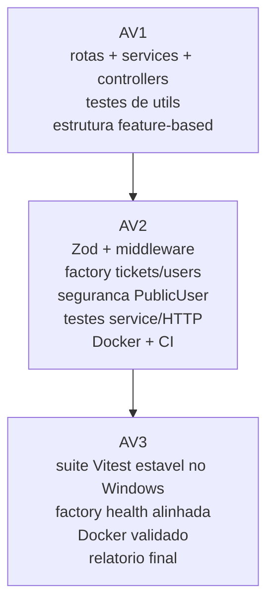
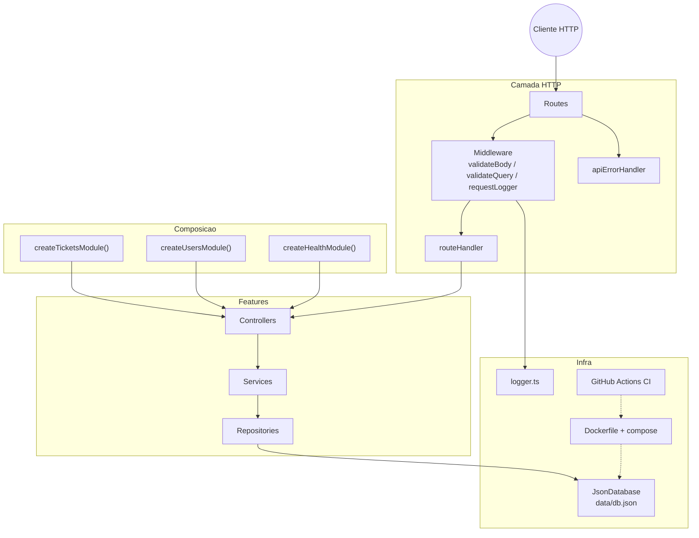

# Arquitetura — Avaliacao 3

Visao da evolucao do projeto ate o Projeto Final Integrador e das camadas atuais.

---

## Evolucao A1 → A2 → A3



Da AV2 para a AV3 o foco foi consolidar, nao expandir: restaurar a suite de testes no Windows (Git Bash), alinhar o modulo health ao padrao de composicao dos demais features e validar o container em runtime, deixando a defesa das decisoes no relatorio/PR final.

---

## Camadas atuais (pos-AV3)



Detalhes de fluxo HTTP (ex.: POST /tickets) permanecem em [ARQUITETURA-A2.md](./ARQUITETURA-A2.md).

---

## Evidencia Docker (AV3)

Validacao local em 2026-08-03:

```bash
npm run seed
docker compose up --build -d
curl http://localhost:3000/api/health
```

Resposta observada (HTTP 200):

```json
{
  "status": "ok",
  "service": "oxetech-helpdesk",
  "timestamp": "2026-08-03T19:30:45.660Z",
  "uptime": 14,
  "database": "reachable"
}
```

Smoke adicional: `GET /api/users` sem campo `password`; `GET /api/tickets?status=open` retornou lista filtrada.
